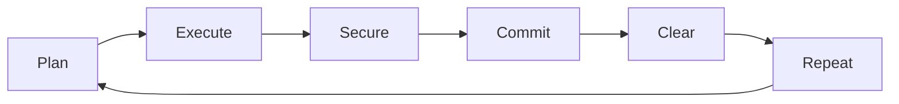
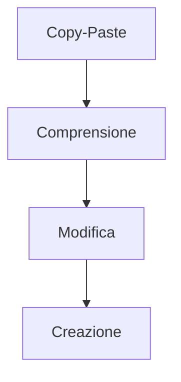

# Claude Code: Segreti e Guida Completa per Cursor AI

<div align="center">

[](https://github.com/freshgr4m)
[](README.md)
[](LICENSE)

*Tutti i segreti per utilizzare Claude Code in modo efficace su Cursor AI.*  
*Basata su esperienza pratica di sviluppo quotidiano.*

</div>

---

## Introduzione

Claude Code è uno strumento potente per lo sviluppo assistito da AI. Questa guida raccoglie le tecniche più efficaci per massimizzarne l'utilizzo, ridurre i bug e migliorare la produttività.

Le strategie presentate sono il risultato di mesi di utilizzo quotidiano e test sul campo, pensate per trasformare il tuo workflow di sviluppo.

---

## Installazione

Prima di iniziare, è necessario configurare l'ambiente di sviluppo. Claude Code può essere utilizzato in diversi editor, ma questa guida si concentra su Cursor AI per l'esperienza ottimale.

### Prerequisiti

> Account Claude attivo  
> Editor con supporto Claude Code (raccomandato: Cursor AI)

### Setup per Sistema Operativo

<details>
<summary><strong>macOS</strong></summary>

```bash
# Installa Cursor AI (raccomandato)
curl -fsSL https://cursor.sh/install.sh | sh

# Per screenshots (fondamentale per Claude Code)
# Cmd + Shift + 4 - Screenshot area selezionata
# File salvati automaticamente su Desktop
```

</details>

<details>
<summary><strong>Windows</strong></summary>

Scarica l'installer da [cursor.sh](https://cursor.sh) ed esegui il file `.exe`.

```bash
# Per screenshots
# Win + Shift + S - Snipping Tool
# File salvati in Pictures/Screenshots
```

</details>

<details>
<summary><strong>Linux</strong></summary>

```bash
# Ubuntu/Debian
curl -fsSL https://cursor.sh/install.sh | sh

# Arch Linux
yay -S cursor-bin

# Per screenshots
# Ctrl + Shift + Print - Screenshot area
# Comando personalizzabile per diverse distro

# Verifica installazione
cursor --version
```

</details>

### Configurazione in Cursor

1. Apri **Settings** → **Extensions**
2. Cerca e installa **Claude Code**
3. Configura le tue credenziali API nelle impostazioni

---

## Configurazione

La configurazione corretta è fondamentale per ottenere risultati ottimali. Il file `claude.md` è il cuore del sistema: definisce regole e comportamenti che Claude seguirà automaticamente.

### Il File claude.md - Le 7 Regole d'Oro

> **Segreto**: Questo file viene letto automaticamente da Claude Code ad ogni prompt. Le regole giuste possono eliminare completamente i bug.

Crea un file `claude.md` nella root del progetto con queste 7 regole specifiche:

```markdown
# Regole di Sviluppo per Claude Code

## 1. Modalità Task
- SEMPRE dividi ogni operazione in micro-task specifici
- Mostra ogni task prima dell'esecuzione
- Aspetta approvazione per ogni step

## 2. Documentazione Live
- Crea una cartella per ogni sessione di lavoro
- Documenta ogni decisione e cambiamento
- Mantieni cronologia di tutti i task eseguiti

## 3. Approvazione Step-by-Step
- MAI eseguire codice senza conferma
- Mostra piano completo prima di iniziare
- Permetti modifiche al piano in qualsiasi momento

## 4. Qualità del Codice
- Usa nomenclatura chiara e consistente
- Includi commenti per logiche complesse
- Ottimizza sempre per leggibilità e performance

## 5. Sicurezza First
- MAI secrets nel frontend
- Valida TUTTI gli input
- Implementa proper error handling

## 6. Testing Continuo
- Testa ogni componente prima di procedere
- Verifica funzionamento dopo ogni modifica
- Mantieni codice sempre in stato funzionante

## 7. Backup Automatico
- Suggerisci commit Git dopo ogni task completato
- Mantieni codice sempre versionato
- Facilita rollback in caso di problemi
```

> **Risultato**: Con queste 7 regole, molti sviluppatori riportano zero bug per mesi di sviluppo.

### Variabili d'Ambiente

```bash
# .env.example
CLAUDE_API_KEY=your_key_here
DATABASE_URL=your_database_url
```

---

## Modalità Plan - La Tecnica Più Potente

La modalità Plan è il segreto per ottenere risultati perfetti ogni volta. **Regola d'oro**: Usala per OGNI micro-step, non solo per task complessi.

### Attivazione

<table>
<tr>
<td width="50%">

**Shortcut Tastiera**
```bash
Shift + Tab + Tab
```

</td>
<td width="50%">

**Comando Esplicito**
```bash
/plan
```

</td>
</tr>
</table>

### Strategia dei Modelli - Risparmio Garantito

> **Segreto del risparmio**: Questa strategia può ridurre i costi del 60-70% mantenendo qualità massima.

| Fase | Modello | Comando | Scopo | Costo |
|------|---------|---------|-------|-------|
| **Pianificazione** | Opus | `/mod opus` | Massima precisione | Alto |
| **Esecuzione** | Sonnet | `/mod sonnet` | Velocità + risparmio | Basso |

### Overuse Plan Mode - La Regola Segreta

**Errore comune**: Usare Plan Mode solo per task complessi.

**Strategia vincente**: 
- Plan Mode per OGNI singolo micro-step
- Anche per modifiche apparentemente semplici
- Sempre prima di scrivere una riga di codice

> **Perché funziona**: Sembra perdita di tempo, ma in realtà risparmi ore di debug. Il planning preciso elimina gli errori alla radice.

### Esempio Pratico

<details>
<summary><strong>Creazione API REST (click per espandere)</strong></summary>

```markdown
# Input in Plan Mode
"Creo una API REST per gestione utenti con:
- Autenticazione JWT
- CRUD operazioni
- Validation middleware
- Rate limiting
- Documentazione OpenAPI"
```

**Risultato**: Claude risponderà con un piano dettagliato step-by-step che potrai approvare prima dell'esecuzione.

</details>

---

## Gestione del Contesto

Il contesto accumula informazioni durante la conversazione, ma può diventare confuso o costoso. La gestione intelligente del contesto è cruciale per mantenere performance e precisione ottimali.

### Comando /clear - Uso Intensivo Strategico

> **Critico**: Usare `/clear` frequentemente è essenziale per mantenere precisione e ridurre costi drasticamente.

**Quando usare `/clear` (molto più spesso di quanto pensi):**

- ✅ **Dopo ogni task decente completato** - Non aspettare task "grandi"
- ✅ **Cambio di argomento o funzionalità** - Anche piccoli cambi
- ✅ **Ogni 30-45 minuti** - Timer fisso, non aspettare problemi
- ✅ **Appena noti risposte inconsistenti** - Primo segnale di allarme

```bash
# Usa questo comando MOLTO più spesso
/clear

# Obiettivo: 10-15 volte al giorno minimo
# Meglio esagerare che risparmiare
```

### Il Problema del Context Bloat

**Cosa succede senza /clear frequente:**
- Context si gonfia → Costi aumentano
- Informazioni confuse → Allucinazioni
- Risposte sempre più lunghe → Inefficienza
- Riferimenti a task obsoleti → Errori

**Benefici del /clear intensivo:**
- 💰 **Risparmio 50-70%** sui costi
- 🎯 **Precisione aumentata** nelle risposte  
- ⚡ **Velocità migliorata** nelle elaborazioni
- 🧠 **Focus mantenuto** sul task corrente

### Indicatori per Clearing

| **Segnali di Allarme** | **Stato Ottimale** |
|---------------------------|------------------------|
| Risposte sempre più lunghe | Risposte concise e precise |
| Ripetizioni di codice | Codice unico e mirato |
| Riferimenti a task obsoleti | Focus sul task corrente |
| Confusione sui requirements | Comprensione chiara |

---

## Utilizzo delle Immagini - Visual Coding Mastery

Claude Code eccelle nell'analisi visiva. Usa screenshots strategicamente per due scopi principali: ispirazione design e debug visuale.

### Shortcuts Screenshot Essenziali

| OS | Shortcut | Risultato |
|:---:|:---:|:---:|
| **macOS** | `Cmd + Shift + 4` | File automatico su Desktop |
| **Windows** | `Win + Shift + S` | Snipping Tool → Pictures/Screenshots |
| **Linux** | `Ctrl + Shift + Print` | Varia per distro |

### Due Casi d'Uso Fondamentali

<details>
<summary><strong>1. Design Inspiration - Copia UI esistenti</strong></summary>

```markdown
# Workflow completo
1. Trova app con UI che ti piace (es. Notion, Todoist)
2. Cmd+Shift+4 (Mac) per screenshot area specifica  
3. Drag & drop immagine in Claude Code
4. Prompt: "Analizza questo design e ricrea un componente simile usando React e Tailwind CSS"

# Esempio concreto
"Voglio aggiungere una todo list che assomiglia a questo screenshot di TickTick. Mantieni il layout e lo stile ma adattalo per React."
```

**Risultato**: Claude analizza lo screenshot e ricostruisce il design pixel-perfect.

</details>

<details>
<summary><strong>2. Debug Visuale - Risolvi problemi UI</strong></summary>

```markdown
# Quando l'app non appare correttamente
1. Screenshot dell'errore o del layout rotto
2. Drag & drop in Claude Code  
3. Prompt: "Questo layout non funziona correttamente. Basandoti sullo screenshot, sistema il CSS per centrare gli elementi"

# Per errori specifici
"L'app dovrebbe apparire così [screenshot atteso] ma invece appare così [screenshot attuale]. Correggi il problema."
```

**Risultato**: Debug visuale immediato senza spiegazioni testuali complesse.

</details>

---

## Sicurezza

La sicurezza non deve essere un ripensamento, ma integrata nel workflow quotidiano. Claude Code può aiutare a identificare vulnerabilità comuni, ma è importante seguire un processo sistematico.

### Security Check - Prompt Esatto da Copiare

**Il problema**: Gli AI non hanno ancora integrata la sicurezza. Molti sviluppatori stanno pubblicando app vulnerabili senza saperlo.

**La soluzione**: Security check sistematico dopo OGNI feature.

```markdown
# 🔒 PROMPT ESATTO - Copia e incolla dopo ogni feature

"Controlla tutto il codice che hai appena scritto e assicurati che segua le best practices di sicurezza. Verifica specificamente:

1. Nessuna informazione sensibile (API keys, password, tokens) è nel frontend
2. Non ci sono vulnerabilità che le persone possono sfruttare  
3. Tutti gli input sono validati e sanitizzati
4. Le password sono hashate correttamente
5. Non ci sono SQL injection vulnerabilities
6. Non ci sono XSS vulnerabilities
7. Il logging non contiene dati sensibili

Se trovi problemi, correggili immediatamente e spiega cosa hai cambiato."
```

### Workflow Sicurezza Obbligatorio

1. **Plan** - Pianifica feature
2. **Build** - Costruisci feature  
3. **Security** - Esegui prompt di sicurezza ↑
4. **Deploy** - Solo dopo ok sicurezza

> **Critical**: Se non hai mai fatto coding prima, devi usare questo prompt 1000 volte. È impossibile esagerare con i controlli di sicurezza.

### Checklist di Sicurezza

- [ ] Secrets solo nel backend/env
- [ ] Input validation su tutti i campi
- [ ] Password hashate (bcrypt)
- [ ] HTTPS configurato
- [ ] CORS impostato correttamente
- [ ] Rate limiting attivo
- [ ] Logging senza dati sensibili

---

## Workflow di Sviluppo

Un workflow strutturato garantisce consistenza e qualità. Questo ciclo si basa su anni di best practices nello sviluppo software, adattate per l'era dell'AI.

### Ciclo Completo



### Git Integration - Sistema di Checkpoint Intensivo

**Strategia comprovata**: Commit frequentissimi per sicurezza massima.

<details>
<summary><strong>Setup Iniziale</strong></summary>

```bash
git init
git add .
git commit -m "🎉 Initial commit"
```

</details>

<details>
<summary><strong>Workflow Intensivo Quotidiano</strong></summary>

```bash
# Dopo OGNI task completato con successo
git add .
git commit -m "✨ Add: [feature description]"
git push

# Obiettivo: 15-20 commit al giorno
# Regola: Codice funziona = Commit immediato
# Codice rotto = Rollback all'ultimo commit
```

**Decision Tree**:
- ✅ **Codice funziona bene**: Commit immediato
- ❌ **Codice con problemi**: `git reset --hard HEAD~1`
- 🔄 **Riprova**: Torna all'ultimo commit funzionante

</details>

### Convenzioni Commit

Le convenzioni commit aiutano a mantenere una cronologia pulita e comprensibile del progetto:

| Tipo | Prefisso | Descrizione | Esempio |
|:---:|:---:|:---|:---|
| **Feature** | `feat:` | Nuove funzionalità | `feat: add user authentication` |
| **Fix** | `fix:` | Correzione bug | `fix: resolve login validation` |
| **Refactor** | `refactor:` | Ristrutturazione codice | `refactor: optimize API calls` |
| **Docs** | `docs:` | Aggiornamenti documentazione | `docs: update API reference` |
| **Style** | `style:` | Formattazione, CSS | `style: improve button layout` |

---

## Apprendimento

Comprendere il codice generato da Claude è essenziale per diventare uno sviluppatore più efficace. Non limitarti a copiare: impara dai pattern e dalle soluzioni proposte.

### Learning Prompt - Comprendi Tutto il Codice

> **Filosofia**: Non devi saper programmare per usare Claude Code, ma più capisci il codice, migliori diventano i tuoi prompt.

**Workflow: Plan → Build → Security → Learn**

```markdown
# 📚 PROMPT ESATTO - Usa dopo ogni security check

"Spiegami in dettaglio la funzionalità e il codice che hai appena costruito. 
Comportati come un senior engineer che sta insegnando a un junior developer:

1. Cosa fa ogni funzione principale che hai creato
2. Perché hai scelto questo approccio specifico  
3. Come i dati fluiscono attraverso l'applicazione
4. Quali pattern di design hai utilizzato
5. Come questo si integra con il resto del codice
6. Possibili miglioramenti futuri che potrei considerare
7. Concetti che dovrei approfondire per capire meglio

Usa un linguaggio che posso capire anche se non sono un programmatore esperto."
```

### Perché è Fondamentale

**Beneficio immediato**: Migliori prompt = Migliori risultati
**Beneficio a lungo termine**: Crescita professionale continua

- 🎯 **Prompt 10x più precisi** quando capisci l'architettura
- 🔧 **Debug più rapido** quando riconosci i pattern
- 🚀 **Sviluppo autonomo** graduale nel tempo
- 💡 **Idee migliori** per nuove features

> **Regola**: Usa questo prompt dopo OGNI feature completata e sicura. La conoscenza si accumula velocemente.

### Progressione



1. **Copy-Paste**: Usa il codice generato così com'è
2. **Comprensione**: Capisci cosa fa il codice
3. **Modifica**: Piccoli aggiustamenti autonomi
4. **Creazione**: Sviluppo indipendente

---

## Ottimizzazione della Produttività

Claude Code richiede tempo per elaborare richieste complesse. Invece di perdere tempo, trasforma questi momenti in opportunità di crescita professionale.

### Chat Produttiva - Sfrutta i Tempi Morti

**Il problema**: Claude Code può richiedere 15-30 minuti per task complessi. La tentazione è doom scrolling sui social.

**La soluzione**: Chat produttiva separata per trasformare attese in crescita.

```markdown
# 💡 PROMPT SETUP - Una sola volta

"Quando programmo con AI, ci sono lunghe pause tra i comandi (15-30 minuti). 
Solitamente perdo questo tempo sui social media, il che mi distrae e peggiora il mio stato mentale.

Voglio usare questo tempo per chattare con te per:
- Generare nuove idee per features 
- Riflettere su decisioni di business e contenuti
- Pianificare architettura per prossimi progetti
- Brainstorming su miglioramenti dell'app corrente
- Strategia di monetizzazione

Aiutami a restare focalizzato e produttivo durante queste pause."
```

### Workflow Produttività 4000%

**Durante attese di Claude Code:**
1. 🚫 **NON** prendere il telefono
2. 🚫 **NON** aprire YouTube/TikTok  
3. ✅ **VAI** alla chat produttiva
4. ✅ **DICI** cosa sta facendo Claude Code
5. ✅ **RIFLETTI** su prossimi step

**Risultato**: Invece di perdere 80% del tempo, usi 100% per crescita professionale.

### Disciplina Necessaria

- 🎯 **Ogni pausa** = Chat produttiva, mai social
- 💡 **Genera idee** per nuovi progetti durante le attese
- 📈 **Pianifica crescita** mentre Claude lavora
- 🧠 **Mantieni focus** invece di disperdere attenzione

> **Testimonianza**: "Da quando uso questa tecnica, ho generato 30+ idee per app nuove che ora sto sviluppando. La produttività è aumentata del 4000%."

### Gestione delle Distrazioni

<table>
<tr>
<td width="50%">

**Evita durante le pause:**
- Social media
- Video casuali  
- News browsing

</td>
<td width="50%">

**Attività produttive:**
- Pianificazione progetto
- Research tecnico
- Documentazione

</td>
</tr>
</table>

---

## Esempi Pratici

Questi esempi mostrano l'applicazione pratica delle tecniche descritte in scenari reali di sviluppo.

### Todo App con React

<details>
<summary><strong>Plan Mode Input (click per espandere)</strong></summary>

```markdown
"Creare todo app con:
- React + TypeScript
- Local storage persistence
- Filtri per stato
- Dark mode toggle
- Responsive design"
```

**Risultato**: Piano dettagliato con 8-10 step verificabili.

</details>

### API REST con Node.js

<details>
<summary><strong>Plan Mode Input (click per espandere)</strong></summary>

```markdown
"API REST per blog con:
- Express + MongoDB
- Autenticazione JWT
- CRUD posts e users
- Middleware validation
- Error handling
- API documentation"
```

**Risultato**: Architettura completa con security best practices.

</details>

---

## Troubleshooting

Problemi comuni e relative soluzioni basate sull'esperienza pratica di utilizzo quotidiano.

<details>
<summary><strong>Claude non risponde correttamente</strong></summary>

**Soluzioni:**
- Usa `/clear` per pulire contesto
- Sii più specifico nei prompt
- Verifica configurazione API

</details>

<details>
<summary><strong>Codice con bug frequenti</strong></summary>

**Soluzioni:**
- Assicurati di avere `claude.md` configurato
- Usa sempre Plan Mode per task complessi
- Implementa security check regolari

</details>

<details>
<summary><strong>Costi elevati</strong></summary>

**Soluzioni:**
- Usa strategia Opus/Sonnet
- Applica `/clear` più frequentemente
- Ottimizza la lunghezza dei prompt

</details>

---

## FAQ

### Claude Code funziona con tutti i linguaggi?

<table>
<tr>
<td width="50%">

**Ottimo supporto:**
- JavaScript/TypeScript
- Python
- React/Vue/Angular
- Node.js
- HTML/CSS

</td>
<td width="50%">

**Supporto limitato:**
- Mobile nativo (Swift/Kotlin)
- Low-level languages (C++/Rust)

</td>
</tr>
</table>

### Quanto costa utilizzare Claude Code?

**Piani disponibili (2025):**

| Piano | Prezzo | Caratteristiche |
|:---:|:---:|:---|
| **Free** | Gratis | Accesso limitato (20-30 msg/giorno) |
| **Pro** | $20/mese* | Uso intensivo, Projects, early access |
| **Team** | $30/utente/mese* | Collaborazione, billing centralizzato |
| **Enterprise** | Custom | Funzionalità avanzate enterprise |

<sub>*Sconto disponibile con fatturazione annuale</sub>

> **Risparmio**: Con le tecniche di ottimizzazione, il risparmio può essere del 50-70%.

### È sicuro per progetti commerciali?

**Sì, seguendo le best practices:**
- Security check regolari
- Mai dati sensibili nei prompt
- Code review umano
- Rispetto delle policy aziendali

---

## Contributing

Questa guida è open source e cresce con la community italiana di sviluppatori. Ogni contributo migliora l'esperienza di tutti.

**Per contribuire:**

1. Fork il repository
2. Crea un branch per la feature
3. Implementa le modifiche
4. Apri una Pull Request

### Tipi di Contributi Benvenuti

- Nuove tecniche testate
- Correzioni e miglioramenti
- Esempi pratici
- Traduzioni

---

## Licenza

**MIT License** - Vedi file `LICENSE` per dettagli.

*Usa, modifica, condividi liberamente!*

---

## Crediti

<div align="center">

**Autore**: Francesco Mancino  
**Ubicazione**: Roma, Italia  
**Contatto**: [mancino22@gmail.com](mailto:mancino22@gmail.com)

**Link utili:**
[](https://www.linkedin.com/in/francesco-mancino-dev/)
[](https://github.com/freshgr4m/claude-code-pro/issues)

---

*Made with ❤️ in Italy • Ultima modifica: Gennaio 2025*

</div>ino--dev-blue?style=flat-square&logo=linkedin)](https://www.linkedin.com/in/francesco-mancino-dev/)
[](https://twitter.com/freshgr4m)
[](https://github.com/freshgr4m/claude-code-pro/issues)

---

*🇮🇹 Made with ❤️ in Italy • Ultima modifica: Gennaio 2025*

</div>
