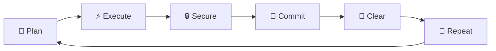
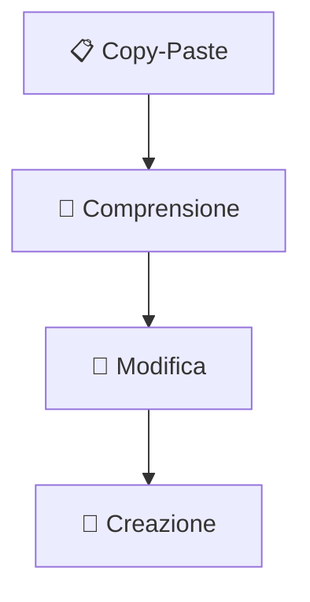

# 🤖 Claude Code: Guida Italiana

<div align="center">

[](https://github.com/freshgr4m)
[](README.md)
[](LICENSE)

*Una collezione di tecniche e strategie per utilizzare Claude Code in modo efficace.*  
*Basata su esperienza pratica di sviluppo quotidiano.*

</div>

---

## 🎯 Introduzione

Claude Code è uno strumento potente per lo sviluppo assistito da AI. Questa guida raccoglie le tecniche più efficaci per massimizzarne l'utilizzo, ridurre i bug e migliorare la produttività.

---

## 🚀 Installazione

### Prerequisiti

> ✅ Account Claude attivo  
> ✅ Cursor AI installato

### Setup per Sistema Operativo

<details>
<summary><strong>🍎 macOS</strong></summary>

```bash
# Installa Cursor AI
curl -fsSL https://cursor.sh/install.sh | sh
```

</details>

<details>
<summary><strong>🪟 Windows</strong></summary>

Scarica l'installer da [cursor.sh](https://cursor.sh) ed esegui il file `.exe`.

</details>

<details>
<summary><strong>🐧 Linux</strong></summary>

```bash
# Ubuntu/Debian
curl -fsSL https://cursor.sh/install.sh | sh

# Arch Linux
yay -S cursor-bin

# Verifica installazione
cursor --version
```

</details>

### ⚙️ Configurazione in Cursor

1. Apri **Settings** → **Extensions**
2. Cerca e installa **Claude Code**
3. Configura le tue credenziali API nelle impostazioni

---

## 📝 Configurazione

### Il File claude.md

> 💡 **Suggerimento**: Questo file viene letto automaticamente da Claude Code ad ogni prompt.

Crea un file `claude.md` nella root del progetto:

```markdown
# 🤖 Regole di Sviluppo

## 🎯 Comportamento
- Dividi ogni task in micro-operazioni
- Chiedi conferma prima di procedere
- Documenta ogni decisione importante

## 💻 Codice
- Usa nomenclatura chiara e consistente
- Includi commenti per logiche complesse
- Ottimizza per leggibilità e performance

## 🔒 Sicurezza
- Mai secrets nel frontend
- Valida tutti gli input
- Implementa proper error handling
```

### 🔧 Variabili d'Ambiente

```bash
# .env.example
CLAUDE_API_KEY=your_key_here
DATABASE_URL=your_database_url
```

---

## 🎯 Modalità Plan

> 🎪 **Best Practice**: La modalità Plan è particolarmente utile per task complessi.

### Attivazione

<table>
<tr>
<td width="50%">

**Shortcut Tastiera**
```bash
Shift + Tab + Tab
```

</td>
<td width="50%">

**Comando Esplicito**
```bash
/plan
```

</td>
</tr>
</table>

### 🧠 Strategia dei Modelli

> 💰 **Ottimizzazione**: Usa modelli diversi per massimizzare qualità e ridurre costi.

| Fase | Modello | Comando |
|------|---------|---------|
| 🎯 **Pianificazione** | Opus | `/mod opus` |
| ⚡ **Esecuzione** | Sonnet | `/mod sonnet` |

### 📖 Esempio Pratico

<details>
<summary><strong>🛠️ Creazione API REST (click per espandere)</strong></summary>

```markdown
# Input in Plan Mode
"Creo una API REST per gestione utenti con:
- Autenticazione JWT
- CRUD operazioni
- Validation middleware
- Rate limiting
- Documentazione OpenAPI"
```

**Risultato**: Claude risponderà con un piano dettagliato step-by-step che potrai approvare prima dell'esecuzione.

</details>

---

## 🧹 Gestione del Contesto

### Comando /clear

> ⚠️ **Importante**: Usare `/clear` regolarmente migliora precisione e riduce costi.

**Quando usare `/clear`:**

- ✅ Completi un task importante
- ✅ Cambi argomento o funzionalità  
- ✅ Noti risposte inconsistenti
- ✅ Dopo 30-45 minuti di lavoro continuo

```bash
# Pulisci il contesto
/clear
```

### 🚨 Indicatori per Clearing

| 🔴 **Segnali di Allarme** | 🟢 **Stato Ottimale** |
|---------------------------|------------------------|
| Risposte sempre più lunghe | Risposte concise e precise |
| Ripetizioni di codice | Codice unico e mirato |
| Riferimenti a task obsoleti | Focus sul task corrente |
| Confusione sui requirements | Comprensione chiara |

---

## 🖼️ Utilizzo delle Immagini

> 🎨 **Visual Coding**: Claude Code può analizzare screenshot per comprendere design e debug visuale.

### 📸 Shortcuts Screenshot

| OS | Shortcut |
|:---:|:---:|
| 🍎 **macOS** | `Cmd + Shift + 4` |
| 🪟 **Windows** | `Win + Shift + S` |
| 🐧 **Linux** | `Ctrl + Shift + Print` |

### 🎯 Casi d'Uso

<details>
<summary><strong>🎨 Design Inspiration</strong></summary>

```markdown
"Analizza questo design di [app] e crea un componente simile 
usando React e Tailwind CSS"
```

</details>

<details>
<summary><strong>🔧 Debug Visuale</strong></summary>

```markdown
"Questo layout non funziona correttamente. Basandoti sullo 
screenshot, sistema il CSS per centrare gli elementi"
```

</details>

---

## 🔒 Sicurezza

> 🛡️ **Security First**: La sicurezza deve essere integrata nel workflow, non aggiunta dopo.

### Security Check

Dopo ogni feature, esegui un controllo di sicurezza:

```markdown
"Analizza il codice per vulnerabilità di sicurezza:
- API keys nel frontend
- SQL injection
- XSS vulnerabilities  
- Input validation
- Error handling sicuro"
```

### ✅ Checklist di Sicurezza

- [ ] Secrets solo nel backend/env
- [ ] Input validation su tutti i campi
- [ ] Password hashate (bcrypt)
- [ ] HTTPS configurato
- [ ] CORS impostato correttamente
- [ ] Rate limiting attivo
- [ ] Logging senza dati sensibili

---

## 🔄 Workflow di Sviluppo

### Ciclo Completo



### 🐙 Git Integration

<details>
<summary><strong>Setup Iniziale</strong></summary>

```bash
git init
git add .
git commit -m "🎉 Initial commit"
```

</details>

<details>
<summary><strong>Workflow Quotidiano</strong></summary>

```bash
git add .
git commit -m "✨ Add: [feature description]"
git push
```

</details>

### 📝 Convenzioni Commit

| Tipo | Emoji | Descrizione |
|:---:|:---:|:---|
| **Feature** | ✨ | Nuove funzionalità |
| **Fix** | 🐛 | Correzione bug |
| **Refactor** | ♻️ | Refactoring codice |
| **Docs** | 📝 | Aggiornamenti documentazione |
| **Style** | 🎨 | Modifiche UI/styling |

---

## 📚 Apprendimento

### 🎓 Learning Prompt

> 🧠 **Pro Tip**: Comprendere il codice generato ti rende un utilizzatore migliore.

```markdown
"Spiegami il codice come se fossi un mentor esperto:
- Cosa fa ogni funzione principale
- Perché hai scelto questo approccio
- Come fluiscono i dati
- Pattern di design utilizzati
- Possibili miglioramenti futuri"
```

### 📈 Progressione



1. **📋 Copy-Paste**: Usa il codice generato così com'è
2. **🧠 Comprensione**: Capisci cosa fa il codice
3. **🔧 Modifica**: Piccoli aggiustamenti autonomi
4. **🚀 Creazione**: Sviluppo indipendente

---

## ⚡ Ottimizzazione della Produttività

### 💬 Chat Produttiva

> 🎯 **Anti-Procrastination**: Trasforma i tempi morti in opportunità di crescita.

Durante i tempi di attesa di Claude Code, usa una chat separata per:

```markdown
"Aiutami a restare produttivo durante le pause:
- Brainstorming nuove features
- Pianificazione architettura
- Idee per miglioramenti
- Strategia di business"
```

### 🚫 Evita Distrazioni vs ✅ Attività Produttive

<table>
<tr>
<td width="50%">

**🔴 Vietato durante le pause:**
- Social media
- Video casuali  
- News browsing

</td>
<td width="50%">

**🟢 Permesso:**
- Pianificazione progetto
- Research tecnico
- Documentazione

</td>
</tr>
</table>

---

## 🛠️ Esempi Pratici

### 📱 Todo App con React

<details>
<summary><strong>Plan Mode Input (click per espandere)</strong></summary>

```markdown
"Creare todo app con:
- React + TypeScript
- Local storage persistence
- Filtri per stato
- Dark mode toggle
- Responsive design"
```

**Risultato**: Piano dettagliato con 8-10 step verificabili.

</details>

### 🌐 API REST con Node.js

<details>
<summary><strong>Plan Mode Input (click per espandere)</strong></summary>

```markdown
"API REST per blog con:
- Express + MongoDB
- Autenticazione JWT
- CRUD posts e users
- Middleware validation
- Error handling
- API documentation"
```

**Risultato**: Architettura completa con security best practices.

</details>

---

## 🔧 Troubleshooting

### ⚠️ Problemi Comuni

<details>
<summary><strong>🤖 Claude non risponde correttamente</strong></summary>

**Soluzioni:**
- Usa `/clear` per pulire contesto
- Sii più specifico nei prompt
- Verifica configurazione API

</details>

<details>
<summary><strong>🐛 Codice con bug frequenti</strong></summary>

**Soluzioni:**
- Assicurati di avere `claude.md` configurato
- Usa sempre Plan Mode per task complessi
- Implementa security check regolari

</details>

<details>
<summary><strong>💸 Costi elevati</strong></summary>

**Soluzioni:**
- Usa strategia Opus/Sonnet
- Applica `/clear` più frequentemente
- Ottimizza la lunghezza dei prompt

</details>

---

## ❓ FAQ

### 🔧 Claude Code funziona con tutti i linguaggi?

<table>
<tr>
<td width="50%">

**✅ Ottimo supporto:**
- JavaScript/TypeScript
- Python
- React/Vue/Angular
- Node.js
- HTML/CSS

</td>
<td width="50%">

**⚠️ Supporto limitato:**
- Mobile nativo (Swift/Kotlin)
- Low-level languages (C++/Rust)

</td>
</tr>
</table>

### 💰 Quanto costa utilizzare Claude Code?

**Piani disponibili (2025):**

| Piano | Prezzo | Caratteristiche |
|:---:|:---:|:---|
| **Free** | Gratis | Accesso limitato (20-30 msg/giorno) |
| **Pro** | $20/mese* | Uso intensivo, Projects, early access |
| **Team** | $30/utente/mese* | Collaborazione, billing centralizzato |
| **Enterprise** | Custom | Funzionalità avanzate enterprise |

<sub>*Sconto disponibile con fatturazione annuale</sub>

> 💡 **Risparmio**: Con le tecniche di ottimizzazione, il risparmio può essere del 50-70%.

### 🔒 È sicuro per progetti commerciali?

**✅ Sì, seguendo le best practices:**
- Security check regolari
- Mai dati sensibili nei prompt
- Code review umano
- Rispetto delle policy aziendali

---

## 🤝 Contributing

> 🌟 **Open Source**: Questa guida è open source e cresce con la community!

**Per contribuire:**

1. 🍴 Fork il repository
2. 🌿 Crea un branch per la feature
3. ✍️ Implementa le modifiche
4. 📫 Apri una Pull Request

### 💡 Tipi di Contributi Benvenuti

- 🔬 Nuove tecniche testate
- 🐛 Correzioni e miglioramenti
- 📖 Esempi pratici
- 🌍 Traduzioni

---

## 📜 Licenza

**MIT License** - Vedi file `LICENSE` per dettagli.

*Usa, modifica, condividi liberamente! 🚀*

---

## 🙏 Crediti

<div align="center">

**👨‍💻 Autore**: Francesco Mancino  
**📍 Ubicazione**: Roma, Italia  
**📧 Contatto**: [mancino22@gmail.com](mailto:mancino22@gmail.com)

**🔗 Link utili:**
[](https://www.linkedin.com/in/francesco-mancino-dev/)
[](https://twitter.com/freshgr4m)
[](https://github.com/freshgr4m/claude-code-pro/issues)

---

*🇮🇹 Made with ❤️ in Italy • Ultima modifica: Gennaio 2025*

</div>
