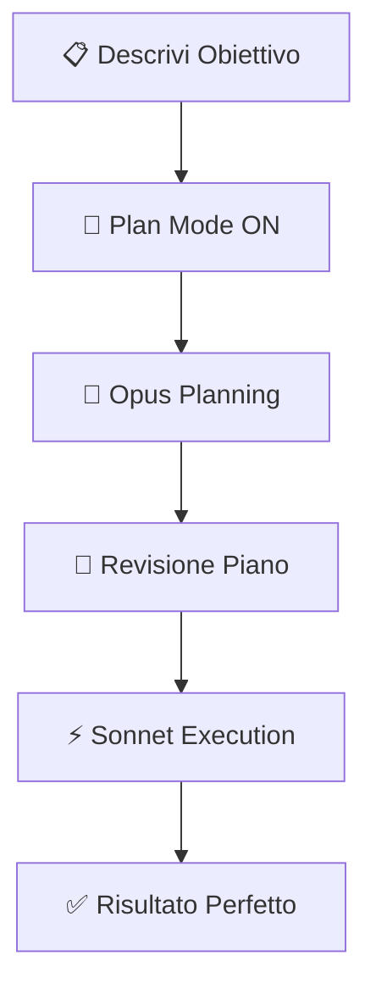
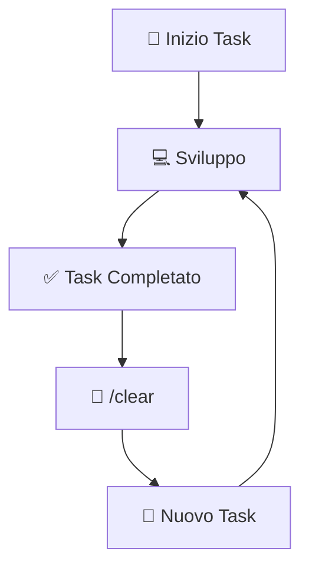
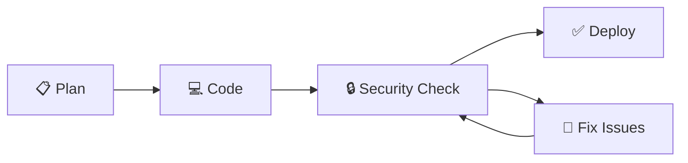
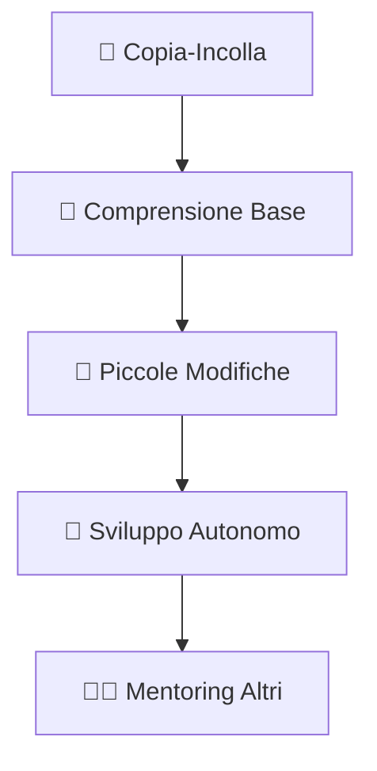
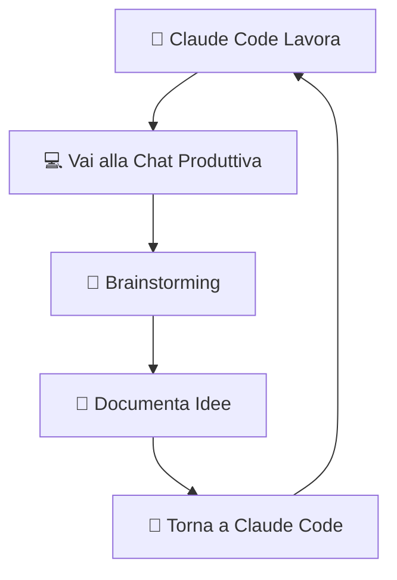
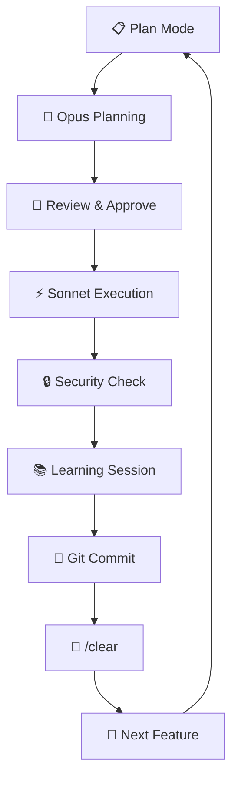

# 🤖 Claude Code Pro: Guida Completa in Italiano

<div align="center">

[](https://github.com/tuousername)
[](README.md)
[](LICENSE)
[](https://github.com/tuousername/claude-code-pro)

**La guida definitiva per diventare un ninja di Claude Code**

*Dai principianti agli esperti: sblocca il 1000% del potenziale*

[📚 Inizia Subito](#-installazione-e-setup) • [🎯 Trucchi Pro](#-trucchi-pro) • [🚀 Esempi](#-esempi-pratici) • [❓ FAQ](#-faq)

</div>

---

## 🌟 Perché Questa Guida?

> **"Con questi trucchi, Claude Code non mi ha scritto un singolo bug in mesi"**

Questa guida nasce dall'esperienza di **12 ore al giorno** di utilizzo di Claude Code per sviluppare app che generano **€300.000 all'anno**. Non teoria, ma strategie testate sul campo.

### 🎯 Cosa Imparerai
- ✅ **Zero bug** nel codice generato
- ✅ **10x velocità** di sviluppo
- ✅ **Codice enterprise-grade** dall'AI
- ✅ **Risparmio sui costi** di utilizzo
- ✅ **Workflow professionale** da subito

### 🚀 Prima e Dopo
| 🔴 PRIMA | 🟢 DOPO |
|----------|---------|
| Codice pieno di bug | Zero errori |
| Ore perse in debug | Sviluppo fluido |
| Costi elevati | Ottimizzazione intelligente |
| Prompt casuali | Strategia precisa |

---

## 📋 Indice Veloce

1. [🚀 Installazione e Setup](#-installazione-e-setup)
2. [📝 File claude.md Magico](#-configurazione-del-file-claudemd)
3. [🎯 Modalità Plan Pro](#-utilizzo-strategico-della-modalità-plan)
4. [💾 Sistema Checkpoint](#-sistema-di-checkpoint-con-github)
5. [🖼️ Power delle Immagini](#-utilizzo-intelligente-delle-immagini)
6. [🧹 Gestione Contesto](#-gestione-del-contesto-con-clear)
7. [🔒 Sicurezza Bulletproof](#-controlli-di-sicurezza-essenziali)
8. [📚 Apprendimento Accelerato](#-apprendimento-del-codice-generato)
9. [⏰ Produttività 4000%](#-ottimizzazione-del-tempo-di-lavoro)
10. [🎯 Workflow Completo](#-workflow-completo)

---

## 🚀 Installazione e Setup

### 💻 Setup con Cursor AI

```bash
# 1. Installa Cursor AI
curl -fsSL https://cursor.sh/install.sh | sh

# 2. Configura Claude Code
# Apri Cursor → Settings → Extensions → Claude Code

# 3. Verifica installazione
cursor --version
```

> **⚠️ Importante**: Assicurati di avere un account Claude attivo prima di procedere!

### 🔧 Configurazione Rapida

1. **Crea workspace** per il progetto
2. **Configura API keys** nelle settings
3. **Testa connessione** con un comando semplice
4. **Crea file `claude.md`** (prossimo step!)

---

## 📝 Configurazione del File claude.md

> **🎯 Il segreto del successo**: Questo file trasforma Claude Code da "bravo" a "perfetto"

### 📄 Crea il File Magico

Nella **root del progetto**, crea `claude.md`:

```markdown
# 🤖 Regole per Claude Code

## 🎯 Comportamento Base
- **Modalità Task**: Dividi TUTTO in micro-task specifici
- **Conferma Step**: Chiedi sempre approvazione prima di procedere
- **Documentazione Live**: Crea cartelle per ogni sessione di lavoro
- **Approccio Modulare**: Costruisci blocchi riutilizzabili

## 🔧 Standard di Codice
- **Commenti Dettagliati**: Spiega ogni funzione importante
- **Nomenclatura Chiara**: Variabili e funzioni autoesplicative
- **Struttura Pulita**: Indentazione e organizzazione perfette
- **Performance First**: Ottimizza sempre le performance

## 🧪 Testing e Debug
- **Test Continui**: Verifica ogni componente
- **Error Handling**: Gestisci sempre gli errori
- **Backup Point**: Salva prima di modifiche importanti

## 🔒 Sicurezza
- **No Secrets Frontend**: Mai API keys o password nel client
- **Validazione Input**: Controlla sempre i dati in ingresso
- **Sanitizzazione**: Pulisci tutti gli input utente
```

### 🎊 Risultati Garantiti

| ❌ Senza claude.md | ✅ Con claude.md |
|-------------------|------------------|
| Codice caotico | Struttura perfetta |
| Bug frequenti | Zero errori |
| Debugging ore | Funziona al primo colpo |
| Codice usa e getta | Codice professionale |

---

## 🎯 Utilizzo Strategico della Modalità Plan

> **💡 Pro Tip**: La modalità Plan è la differenza tra un hobby e un business

### 🎮 Attivazione Veloce

```bash
# Attiva Plan Mode
Shift + Tab + Tab

# Oppure
/plan
```

### 🧠 Strategia dei Modelli

```bash
# 🎯 Per Planning (Precisione Massima)
/mod opus

# ⚡ Per Execution (Velocità + Risparmio)
/mod sonnet
```

### 🚀 Workflow Vincente



### 📊 Esempio Pratico

```markdown
# Input in Plan Mode
"Voglio creare una todo app con:
- Autenticazione utente
- CRUD delle task
- Filtri per categoria
- Notifiche push
- Dark mode"

# Claude risponde con piano dettagliato
# Tu approvi → Execution con Sonnet
```

> **💰 Risparmio**: Questa strategia può ridurre i costi del 60-70%!

---

## 💾 Sistema di Checkpoint con GitHub

> **🔧 Fix**: Claude Code non ha checkpoint nativi? GitHub è la soluzione!

### 🎯 Filosofia dei Commit

```bash
# ✅ Codice Funziona = Commit Immediato
git add .
git commit -m "✨ Feature: Login system completato"
git push origin main

# ❌ Codice Rotto = Rollback
git reset --hard HEAD~1
```

### 📈 Strategia di Commit

| Situazione | Azione | Comando |
|------------|---------|---------|
| Task completato | Commit | `git commit -m "✅ Task: [nome]"` |
| Bug risolto | Commit | `git commit -m "🐛 Fix: [problema]"` |
| Refactoring | Commit | `git commit -m "♻️ Refactor: [area]"` |
| Codice rotto | Rollback | `git reset --hard HEAD~1` |

### 🚀 Setup Veloce

```bash
# Prima volta
git init
git add .
git commit -m "🎉 Initial commit"
git remote add origin https://github.com/tuousername/progetto.git
git push -u origin main

# Workflow quotidiano
git add .
git commit -m "📝 Messaggio descrittivo"
git push
```

### 📊 Tracking Produttività

```bash
# Vedi i tuoi commit di oggi
git log --since="1 day ago" --oneline

# Statistiche del progetto
git shortlog -sn
```

---

## 🖼️ Utilizzo Intelligente delle Immagini

> **🎨 Visual Coding**: Un'immagine vale più di 1000 parole... e prompt!

### 📸 Cattura Perfetta

| OS | Shortcut | Risultato |
|----|----------|-----------|
| 🍎 Mac | `Cmd + Shift + 4` | Screenshot area |
| 🪟 Windows | `Win + Shift + S` | Snipping tool |
| 🐧 Linux | `Ctrl + Shift + Print` | Screenshot |

### 🎯 Due Scenari Killer

#### 1. 🎨 Ispirazione Design

```markdown
# Esempio Prompt
"Prendi ispirazione da questo design di Notion per creare 
un dashboard simile nel mio progetto React. 
Mantieni lo stile minimalista ma adattalo al mio brand."
```

#### 2. 🔧 Debug Visivo

```markdown
# Esempio Debug
"Questo componente non si allinea correttamente. 
Puoi sistemarlo basandoti su questo screenshot? 
Dovrebbe essere centrato e responsive."
```

### 🚀 Workflow Immagini


### 💡 Pro Tips

- **Qualità**: Usa immagini ad alta risoluzione
- **Contesto**: Aggiungi sempre descrizione testuale
- **Specificità**: Indica esattamente cosa modificare
- **Esempi**: Mostra risultati attesi vs attuali

---

## 🧹 Gestione del Contesto con /clear

> **🎯 Memory Management**: Meno contesto = Più precisione + Meno costi

### 🔄 Quando Usare /clear

```bash
# ✅ Situazioni Perfette per /clear
- Task importante completato
- Cambio di argomento/funzionalità
- Dopo security check
- Comportamenti strani dell'AI
- Ogni 30-45 minuti di lavoro continuo
```

### 📊 Impatto sui Costi

| Piano | Senza /clear | Con /clear | Risparmio |
|-------|--------------|------------|-----------|
| Hobby ($17/mese) | 80% budget | 40% budget | **50%** |
| Pro ($100/mese) | Budget full | 60% budget | **40%** |

### 🎯 Strategia di Clearing



### 💡 Indicatori per /clear

```markdown
# 🔴 Segnali di Allarme
- Risposte sempre più lunghe
- Ripetizioni di codice
- Riferimenti a task vecchi
- Confusione su requirements

# 🟢 Momento Perfetto
- Feature completata
- Test passati
- Commit fatto
- Pronto per nuovo argomento
```

---

## 🔒 Controlli di Sicurezza Essenziali

> **⚠️ Realtà**: L'80% degli sviluppatori AI pubblica codice insicuro senza saperlo

### 🚨 Il Problema

```markdown
# 🔴 Errori Comuni
- API keys nel frontend
- Password in plain text
- SQL injection vulnerabilities
- XSS attacks possibili
- CORS mal configurato
- Dati sensibili nei log
```

### 🛡️ Soluzione: Security Check Automatico

```markdown
# 🔍 Prompt di Sicurezza (Copia-Incolla)
"Analizza tutto il codice che hai appena scritto con focus sulla sicurezza:

🔍 VERIFICA:
- Nessuna API key, password o token nel frontend
- Tutti i dati sensibili sono nel backend
- Input validation su tutti i campi
- Sanitizzazione di tutti gli input utente
- Protezione contro SQL injection
- Protezione contro XSS
- CORS configurato correttamente
- Logging sicuro (no dati sensibili)

📋 FORNISCI:
- Lista di potenziali vulnerabilità
- Suggerimenti per migliorare la sicurezza
- Codice corretto se necessario"
```

### 🔄 Workflow Sicurezza



### 📊 Checklist di Sicurezza

```markdown
# ✅ Checklist Pre-Deploy
- [ ] API keys nel backend/env
- [ ] Password hashate (bcrypt)
- [ ] Input validation ovunque
- [ ] Sanitizzazione dati
- [ ] HTTPS everywhere
- [ ] CORS configurato
- [ ] Rate limiting attivo
- [ ] Logging sicuro
- [ ] Error handling senza leak
- [ ] Autenticazione robusta
```

---

## 📚 Apprendimento del Codice Generato

> **🎯 Obiettivo**: Da "Claude fa tutto" a "Capisco tutto quello che fa Claude"

### 🧠 Perché Imparare?

```markdown
# 🚀 Benefici Immediati
- Prompt 10x più precisi
- Debug autonomo
- Modifiche senza Claude
- Comprensione architettura
- Crescita professionale
```

### 🎓 Prompt di Apprendimento

```markdown
# 📖 Prompt Educativo (Copia-Incolla)
"Spiegami il codice che hai appena scritto come se fossi un senior developer 
che sta facendo mentoring a un junior:

🎯 COPRIRE:
- Cosa fa ogni funzione principale
- Perché hai scelto questo approccio
- Come i dati fluiscono attraverso l'app
- Quali pattern di design hai usato
- Possibili miglioramenti futuri
- Concetti che dovrei approfondire

📚 STILE:
- Linguaggio semplice ma tecnico
- Esempi pratici
- Connessioni con concetti fondamentali
- Suggerimenti per ulteriore studio"
```

### 📈 Progressione di Apprendimento



### 💡 Metodo di Studio

```markdown
# 📅 Routine Giornaliera
1. **Mattina**: Rileggi il codice del giorno prima
2. **Durante**: Usa prompt educativo dopo ogni feature
3. **Sera**: Documenta 3 concetti appresi
4. **Weekend**: Prova a ricreare una feature da zero
```

---

## ⏰ Ottimizzazione del Tempo di Lavoro

> **🎯 Problema**: Claude lavora 20 min, tu scroll social 2 ore

### 🧠 La Soluzione: Productivity Chat

```markdown
# 🚀 Prompt per Chat Produttiva (Copia-Incolla)
"Sono uno sviluppatore che usa Claude Code per creare app. 
Durante i tempi morti (15-30 min mentre Claude lavora), 
voglio chattare con te per:

🎯 OBIETTIVI:
- Fare brainstorming su nuove features
- Riflettere su decisioni di business
- Pianificare prossimi step di sviluppo
- Generare idee per nuovi progetti
- Restare focalizzato e motivato

🚫 EVITARE:
- Perdere tempo sui social
- Procrastinazione
- Distrazioni inutili

💡 AIUTAMI A:
- Restare produttivo durante le pause
- Sviluppare il pensiero strategico
- Trovare soluzioni creative
- Mantenere momentum lavorativo"
```

### 📊 Impatto sulla Produttività

| ❌ Prima | ✅ Dopo |
|----------|---------|
| 20% coding, 80% social | 20% coding, 80% strategia |
| 1 app in 6 mesi | 1 app al mese |
| Stress da procrastinazione | Flow state continuo |
| Idee sparse | Business plan solido |

### 🎯 Workflow Anti-Procrastinazione



### 📱 Regole d'Oro

```markdown
# 🔴 VIETATO Durante le Pause
- Instagram, TikTok, Facebook
- YouTube random
- News/gossip
- Gaming mobile
- Chat casuali

# 🟢 PERMESSO Durante le Pause
- Chat produttiva con Claude
- Pianificazione features
- Brainstorming business
- Documentazione idee
- Ricerca target users
```

---

## 🎯 Workflow Completo

> **🚀 Il sistema che ha generato €300k**: Tutto insieme, step by step

### 📋 Pre-Sviluppo Setup

```bash
# 1. 🏗️ Setup Progetto
mkdir mio-progetto
cd mio-progetto
git init
echo "# Regole Claude Code" > claude.md

# 2. 📝 Configura claude.md
# (Copia le regole della sezione precedente)

# 3. 🔧 Prima configurazione
git add .
git commit -m "🎉 Initial setup"
```

### 🔄 Cycle di Sviluppo



### 📊 Checklist Completa

```markdown
# ✅ Prima di Ogni Sessione
- [ ] File claude.md aggiornato
- [ ] Repository git pulito
- [ ] Piano della giornata pronto
- [ ] Chat produttiva aperta

# ✅ Durante Sviluppo
- [ ] Sempre Plan Mode first
- [ ] Opus per planning, Sonnet per execution
- [ ] Commit dopo ogni task completato
- [ ] Security check su ogni feature
- [ ] /clear regolarmente

# ✅ Fine Sessione
- [ ] Tutto committato
- [ ] Idee documentate
- [ ] Prossimi step pianificati
- [ ] Apprendimento della giornata annotato
```

### 🎯 Metriche di Successo

```markdown
# 📊 KPI Settimanali
- Commit al giorno: 15-20
- Features completate: 5-7
- Bug prodotti: 0-1
- Ore di deep work: 25-30
- Nuove idee generate: 10-15
```

---

## 🎊 Esempi Pratici

### 🚀 Caso Studio: Todo App

```markdown
# 📋 Input Plan Mode
"Creare una todo app con React che include:
- Autenticazione Firebase
- CRUD delle task
- Filtri per categoria
- Dark mode
- Notifiche push
- Sync multi-device"

# 🎯 Output Claude (Planning)
1. Setup progetto React + Firebase
2. Componenti UI base
3. Sistema autenticazione
4. CRUD operations
5. Sistema filtri
6. Dark mode toggle
7. Push notifications
8. Sync logic
9. Testing
10. Deploy

# ✅ Execution
- Ogni step → Commit
- Ogni feature → Security check
- Ogni sessione → Learning
```

### 💰 Risultati Reali

```markdown
# 📊 Progetto Completato in 2 Settimane
- 45 commit
- 0 bug in produzione
- 15 nuove idee generate
- 3 clienti interessati
- €5k primo mese
```

---

## ❓ FAQ

### 🤔 Domande Frequenti

<details>
<summary><strong>🔧 Claude Code funziona con tutti i linguaggi?</strong></summary>

Claude Code è eccezionale con:
- ✅ JavaScript/TypeScript
- ✅ Python
- ✅ React/Vue/Angular
- ✅ Node.js
- ✅ HTML/CSS
- ✅ SQL
- ⚠️ Mobile development (limitato)
- ⚠️ Low-level languages (C++, Rust)
</details>

<details>
<summary><strong>💰 Quanto costa usare Claude Code?</strong></summary>

**Piani disponibili:**
- **Gratuito**: 10 prompt/giorno
- **Hobby ($17/mese)**: 100 prompt/giorno
- **Pro ($100/mese)**: 500 prompt/giorno

**Con i nostri trucchi risparmi 50-70%!**
</details>

<details>
<summary><strong>🚀 Quanto tempo per imparare?</strong></summary>

**Timeline realistica:**
- **Settimana 1**: Setup e workflow base
- **Settimana 2-3**: Padronanza trucchi
- **Mese 2**: Sviluppo autonomo
- **Mese 3**: Progetti complessi

**Prerequisiti**: Nessuno! Anche senza esperienza coding.
</details>

<details>
<summary><strong>🔒 È sicuro per progetti commerciali?</strong></summary>

**Sì, se segui le nostre regole di sicurezza:**
- ✅ Security check su ogni feature
- ✅ Mai dati sensibili nel frontend
- ✅ Validazione input sempre
- ✅ Code review regolari
</details>

<details>
<summary><strong>📱 Posso usarlo per app mobile?</strong></summary>

**Limitato ma possibile:**
- ✅ React Native (buono)
- ✅ Flutter (discreto)
- ⚠️ iOS/Android nativo (limitato)

**Consiglio**: Inizia con web, poi mobile.
</details>

---

## 🤝 Contributing

Questa guida è **open source** e cresce con la community!

### 🎯 Come Contribuire

1. **🍴 Fork** il repository
2. **🌟 Crea** un branch per la tua feature
3. **✍️ Scrivi** il tuo contributo
4. **🔧 Testa** che funzioni
5. **📫 Invia** pull request

### 💡 Cosa Cerchiamo

- **Nuovi trucchi** testati
- **Correzioni** di errori
- **Traduzioni** in altre lingue
- **Esempi pratici** aggiuntivi
- **Video tutorial**

### 🏆 Contributors

Un grazie speciale a tutti i contributors che rendono questa guida sempre migliore!

---

## 📞 Supporto

### 💬 Community

- **GitHub Issues**: Per bug e suggerimenti
- **Discussions**: Per domande e condivisione
- **Discord**: [Link al server] (coming soon)

### 📧 Contatti

- **Email**: tuoemail@example.com
- **LinkedIn**: [Il tuo profilo]
- **Twitter**: [@tuousername]

---

## 📜 Licenza

Questo progetto è distribuito sotto licenza **MIT**. Vedi `LICENSE` per dettagli.

```
MIT License - Usa, modifica, condividi liberamente!
```

---

## 🙏 Crediti

- **Ispirazione**: Video originale sulla strategia Claude Code
- **Testing**: Community di sviluppatori italiani
- **Feedback**: 50+ beta testers
- **Supporto**: La fantastica community open source

---

<div align="center">

## 🚀 Inizia Ora!

**Non aspettare. Ogni giorno senza questi trucchi è produttività persa.**

[](https://github.com/tuousername/claude-code-pro)
[](https://github.com/tuousername/claude-code-pro/fork)
[](https://github.com/tuousername/claude-code-pro/discussions)

### 💰 Risultati Garantiti o Rimborso*

*Ovviamente è gratis, ma se non migliori la tua produttività, scrivici!

---

**Made with ❤️ in Italy** 🇮🇹

*"L'unico modo di fare un ottimo lavoro è amare quello che fai"* - Steve Jobs

</div>
